# MLOps Pipeline

<!-- ## TODO: provide more detail to this README -->

## Overview: 
- MLOps Pipeline with integration of infrastructure for single-node/distributed training for traditional ML/Deep learnng/LLM. 
- Models are to be logged with mlflow, and deployed with Seldon.
- 1 single web UI to access every component (Airflow, Mlflow, ML training project launcher, Monitor UI for distributed jobs, UI for model deployment, UI for model inference (for testing convenivence only)).

Disclaimer: I do this solo, there is still much that could be improved upon the already implemented. Maybe i'll do when I have the energy
## Note:

This repository contains Ansible playbooks for automating the build, deployment, and undeployment of a cluster. 
**Disclaimer:** The installation of Kubernetes Custom Resource Definitions (CRDs) is not yet included in the playbook.

## Pipeline Diagrams
### Distributed training

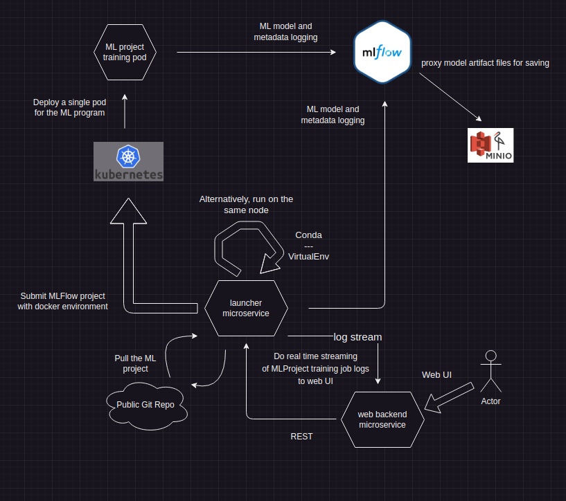
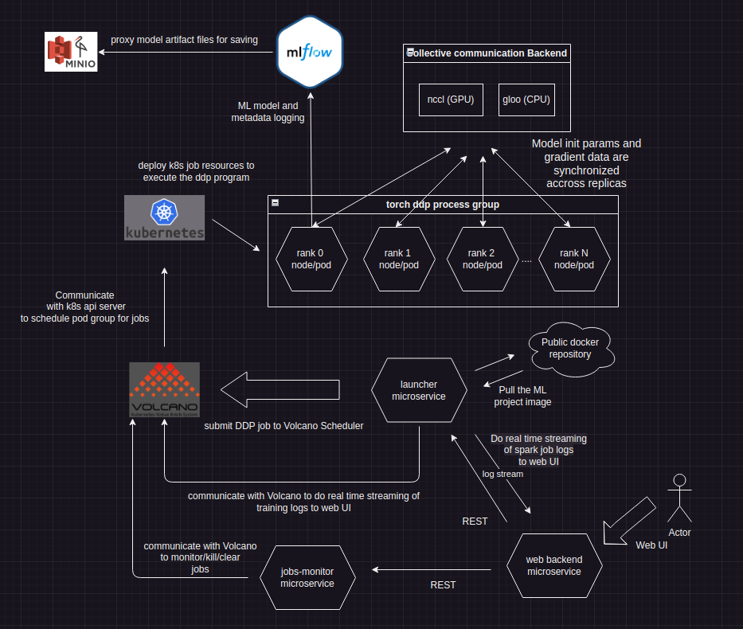
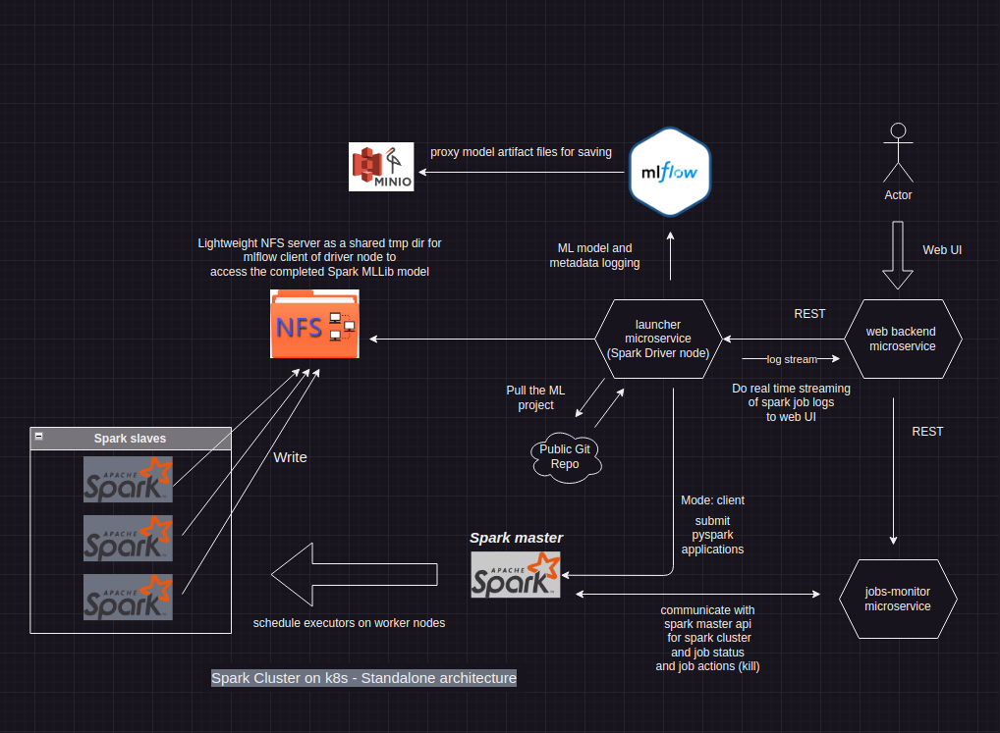

### Model Deployment
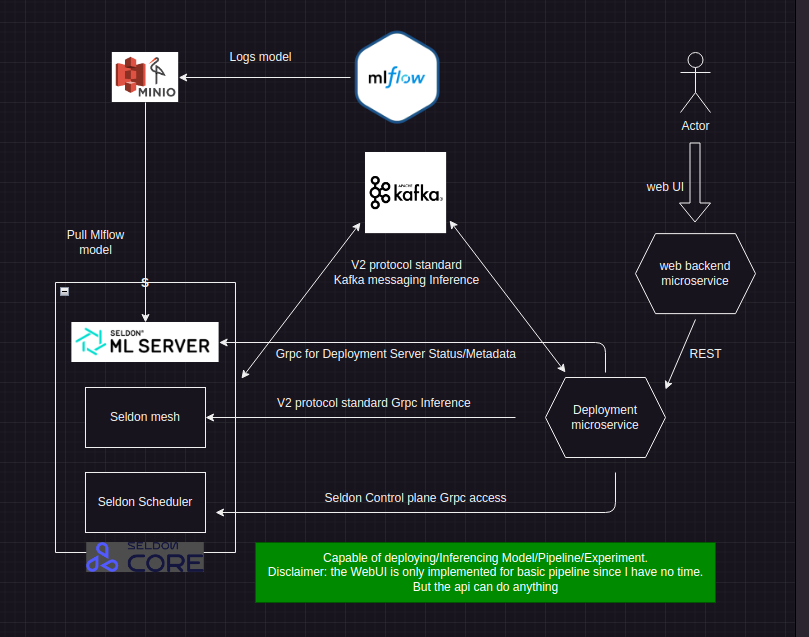

The deployment UI is capable of: 
- model deployment
- pipeline deployment: user trigger -> model A predict -> convert model A predict to model B input -> model B predict -> user receive
- Experiment (A/B testing of model): spltting traffic between 2 or more versions of the same/different models by weights that add up to 100%

### Security architecture
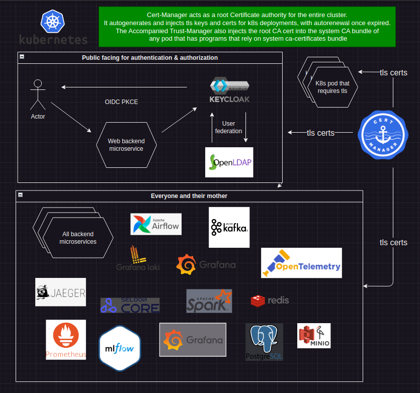

Thanks to cert-manager and trust-manager, we don't have to either burn the certs into the docker image, or manually generate the certs, then manually create volume for the certs, then manually mount the certs to the pod, then manually re-generate the certs once expired. 

### Telemetry architecture
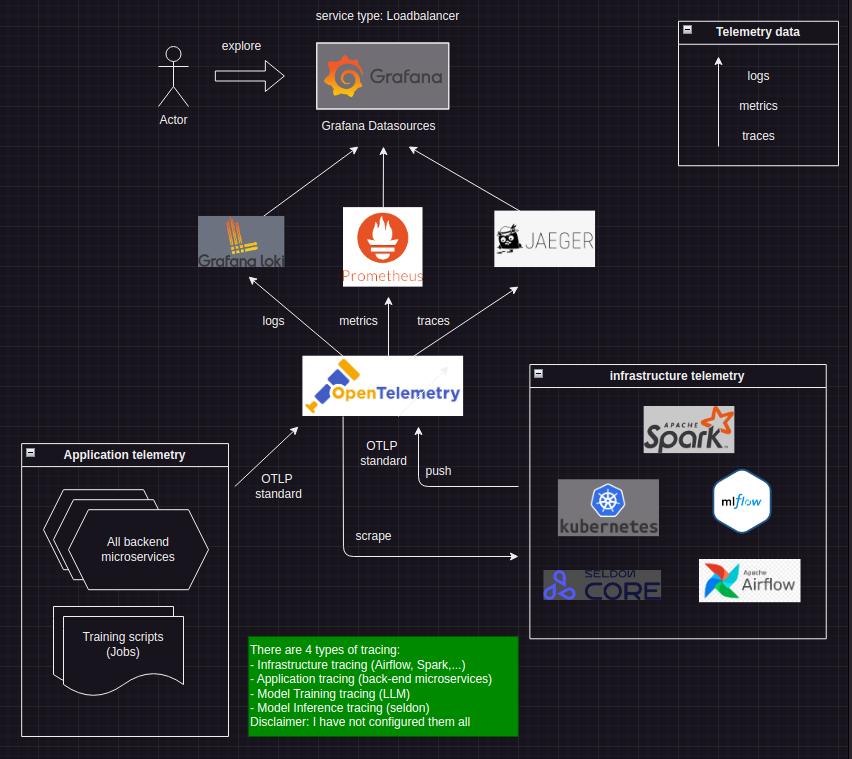

## Some notable difficulties encountered
### Spark 
The decision to include spark resulted in the most time consuming problems, and also a great deal of mental illness lmfao.

The thing about spark cluster standalone mode on k8s is that the submitting of spark application in 'cluster' mode isn't supported.
What does this imply?
- spark applications weren't run inside the spark "cluster" itself (even though I deploy the spark "cluster" on the k8s cluster, that doesn't mean they are the same, the spark "cluster" are made up of spark slaves and masters only).
    + This mean spark pods/nodes can't know the ip of the node/pod that is running the spark context (driver node). For it to work, we must set the spark host explicitly in the spark app, or in the spark conf file of the driver node, like below: 

    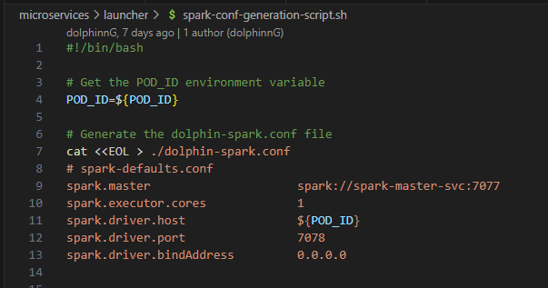

    OR 

    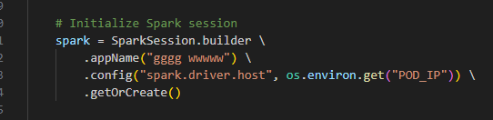

    The POD_IP is to be injected by k8s into the container by this part in the deployment yaml file for:
    

    + MLFlow needs to access the fully finished spark ML model in order to log (save) it. The spark model is spread accross spark slaves and in parts. Normally, if MLFlow was running on the spark "cluster", it would have no issue accessing the shared tmp dir being written to by the slaves. But since the driver node is outside the cluster (only submitting in 'client' mode is allowed), MLFlow can't fully access every part of the model. The result is that we will see a successful experiment run, with successful model logging. But the actual data saved would have only metadata parts of the model without the actual model parts. 
        - A naive solution for this is to mount a shared k8s volume to the launcher and the spark pods, but it would only works on a minikube cluster, where everyone is on 1 node. When we scale the k8s cluster to be on multiple nodes, the same k8s volume could be mapped to the filesystem of different nodes, which defeats our purpose.
        - A better solution is to use a k8s nfs volume, that is, a volume backed by an nfs server. 
        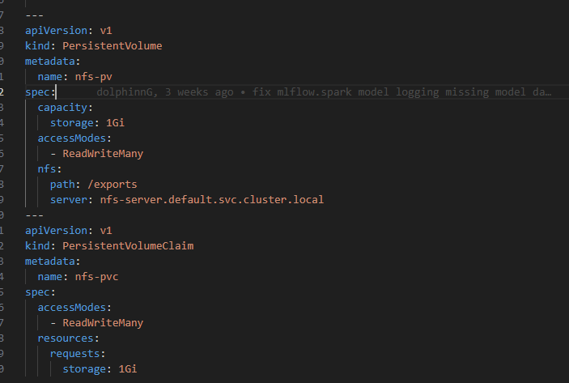

        Tranining scripts must then direct mlflow to use this as tmp dir for model logging: 

        

- There is no easy way for creating a virtual python env for every application. Even though additional files other than the main spark app file can still be sent along, 3rd party libraries that need to be installed via pip, conda, wheel, ... can't. Currently I'm relying on the spark nodes' eviroment to have all the needed libraries for a spark app to run. Any additional libraries must currently need to be built into the image and be redeployed. 

This issue could probably be solved only when we change the spark cluster architecture to something that isn't stanalone cluster.

### Torch DDP
As cool as torchX and volcano vcctl, they operate on the assumption that you are a human outside of the cluster, who wants to do something inside the cluster. They rely on your local kubectl config located often at ~/.kube/config

But when you want to turn these procedural manual CLI thingy into something programmatical, and that can be run by a process inside the cluster itself, the process can't find such config since it is no longer running on your local machine. 

The solution to this type is to attach a service account with sufficient permission to the pod running the process, and dynamically generate the config file for these kind of programs/binaries to use.

-  generate_kubeconfig.py

```python 
import os
import base64
import yaml

def generate_kubeconfig():
    # Define the paths to the service account files
    sa_path = "/var/run/secrets/kubernetes.io/serviceaccount"
    token_path = os.path.join(sa_path, "token")
    ca_path = os.path.join(sa_path, "ca.crt")
    namespace_path = os.path.join(sa_path, "namespace")

    # Read the service account token, CA certificate, and namespace
    with open(token_path, 'r') as f:
        token = f.read().strip()
    with open(ca_path, 'rb') as f:  # Read as binary
        ca_cert = base64.b64encode(f.read()).decode('utf-8')  # Encode in base64
    with open(namespace_path, 'r') as f:
        namespace = f.read().strip()

    # Construct the kubeconfig dictionary
    kubeconfig = {
        'apiVersion': 'v1',
        'clusters': [{
            'cluster': {
                'server': 'https://kubernetes.default.svc',  # The default Kubernetes API server URL
                'certificate-authority-data': ca_cert
            },
            'name': 'kubernetes'
        }],
        'contexts': [{
            'context': {
                'cluster': 'kubernetes',
                'namespace': namespace,
                'user': 'default'
            },
            'name': 'default'
        }],
        'current-context': 'default',
        'kind': 'Config',
        'preferences': {},
        'users': [{
            'name': 'default',
            'user': {
                'token': token
            }
        }]
    }

    # Write the kubeconfig to a file
    kubeconfig_path = os.path.join(os.path.expanduser("~"), ".kube", "config")
    os.makedirs(os.path.dirname(kubeconfig_path), exist_ok=True)
    with open(kubeconfig_path, 'w') as f:
        yaml.dump(kubeconfig, f)

if __name__ == "__main__":
    generate_kubeconfig()
```

Note: MLFlow training script must take care to check for whether it is running on rank 0 node/pod before doing anything mlflow related.

### Seldon
For something that is supposed to be a "state of the art" solution for ML model deployment, Seldon has both 
 - disastrously obscure documentation AND 
 - at times, buggy operations.

Despite having read so much of the official doc for Seldon v2 to the point that I sometime memorize the words in it, for the deployment parts of this to be up and running, a lot of source code deep diving and even manual modification of the source docker image (MLServer) was needed

That is a shame! It appears they tried to cater to too many in order to be able to somehow achieve compatibility across many model formats, but the individual support for each isn't fully completed.

For example, the support for mlflow can't make use of the env specification in MLModel file of mlflow (Might be possible if we include a model-settings.json in the directory of the mlflow model, but what a barbaric solution that is lmao). 

What does this imply? 

It means seldon, or the mlserver it relies on doesn't automatically read the conda/virtualenv of mlflow MLModel file, but relies on the pod's local python env to satisfy the deployed model. 

### Telemetry 

A lot of time was invested in telemetry since this was an uncharted territory for me. Most dev/guide/course just stop at logging, and only logging to a file that they would never read. That suffices for small scaled, demo projects. But once your system has multiple moving parts that aren't accessible directly on your local machine, your game of telemetry must be also be leveled up.

One issue that I still haven't figured out is the dependency graph in grafana for jaeger datasource, which currently returns blank despite when testing locally with 2 fastapi apps, it returns the graph correctly. I might investigate this once i have the time. Since I have configured tracing for all microservices and seldon and some other infrastructure deployments, I expect to have a detailedd dependency graph in grafana, something like this photo:

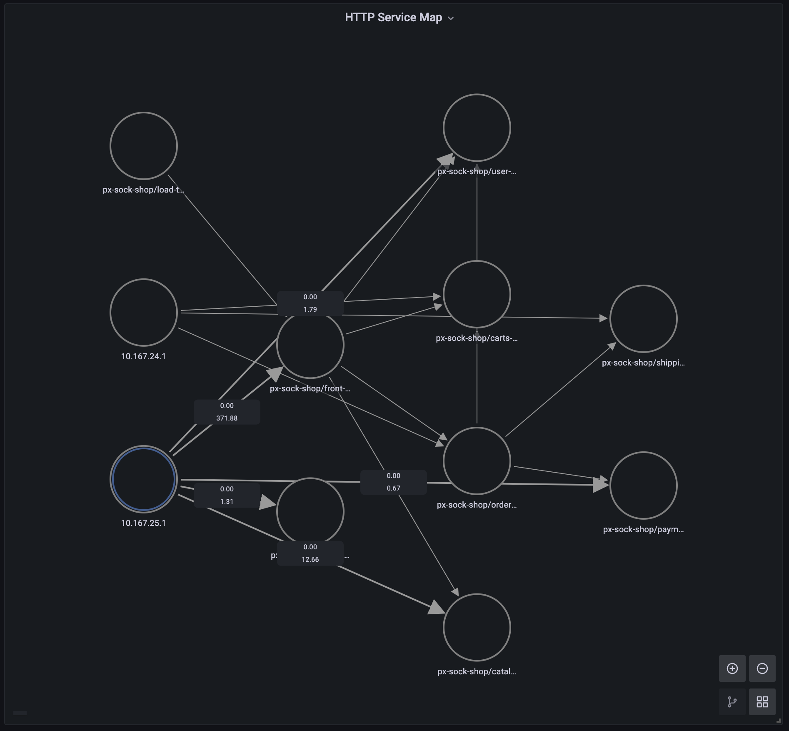

### Separate Clusters for segregation of duties

Currently, everyone and their mother are running on 1 cluster.

In a real production scenario, I suppose there should be 3 separate clusters, with inter-cluster communication through something like Calico.


My take: 

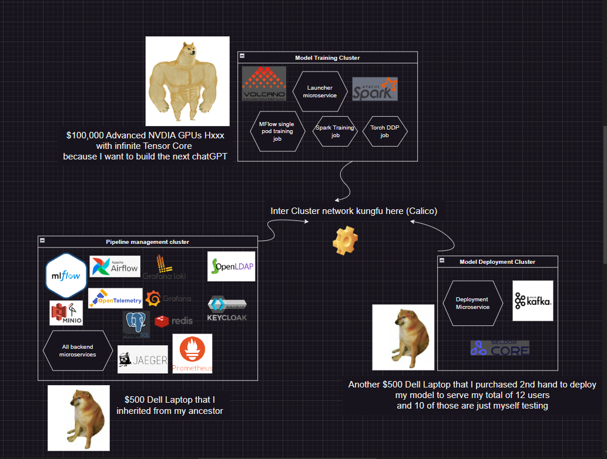

## What I intended to further implement 

1. Better integration of the pipeline with Airflow through Kafka.
    Currently, there is a disintegration of Airflow to the entire pipeline. If one wants to use airflow, one has to know lots about the internal of the entire pipeline to write a DAG script. This issue can be curbed by introducing appropriate kafka's topics and custom Airflow oeprators/hooks that utilize those topics under the hood, thus relieve DAG writers from learning about the system.

2. Auto retrain and auto redeploy when alerted by Prometheus Alert Manager for model drift or outlier detection by models trained with this pipeline.
    - Basically, we can have a middleware service that read the inference result of outlier or drift detection models, then push updates to preconfigured prometheus metrics about the frequency of drift/outlier detection for a specific model. 
    - We can the configure Prometheus Alert Manager to have rules that trigger webhooks that call to a Airflow to re-run(or run) a dag script that responsible for retraining and/or redeploying. 
A simple POC of this can be found at docker-compose-test/alert where I have a webhook and alerting rules configured that can be reused for many models. Basically, each models create a branch in that metric series.

Let's peek at it: 

```python
groups:
  - name: model_drift_alerts
    rules:
      - alert: ModelDriftDetected
        expr: model_drifted_total > 10
        for: 1m
        labels:
          severity: critical
        annotations:
          summary: "Model Drift Detected ({{ $labels.model }})"
          description: "Model drift detected for {{ $labels.model }}. The value of model_drifted_total is {{ $value }}."
          model: "{{ $labels.model }}"
```
3. LLM LangGraph Agent to simplify model inference with the obscure V2 Open Inference protocol.
The standard and established inference protocol https://kserve.github.io/website/0.8/modelserving/inference_api/

The protocol requires some deep knowledge about the protocol in order to construct a simple input, that means more mental burden for anyone.

Who can look at this milkshake and think "Great stuff!" and this is just to call for inference of a very simple model
```json
{
    "name": "iris",
    "implementation": "mlserver_sklearn.SKLearnModel",
    "inputs": [
        {
            "name": "predict",
            "datatype": "FP32",
            "shape": [-1, 4]
        }
    ],
    "outputs": [
        {
            "name": "predict",
            "datatype": "INT64",
            "shape": [-1, 1]
        }
    ],
    "parameters": {
        "version": "1"
    }
}
```

It would be greate if we can have an agent that takes natural language input and translate into this kind of overly complicated object
I suppose that a simple LLM agent with structured output, or tool calling can handle this. 

## Conclusion

MLOps isn't a very established field, as in, there is not enough relevant/detailed/beyond beginner level materials. Even the documentations are obscure. And there is no well tested pattern, like we do login/logout in api programming for example. 
I suppose that small to medium organizations, and even many university labs don't even care about a pipeline and just do anything manually. 

A complete pipeline from data ingestion to deployment that includes observability is something only big tech corps, or industrial labs who have a bunch of resources and talents would care.

I probably will do the further implementation if I have the time and energy lmao. Since these further implementations are nothing new and more advanced to me anymore, they are just things I already know, time can be better spent somewhere else.

Currently I'm investing in LLM agents and offensive security, trying to somehow put up an multi-agent system that can leverage cyber attack tools.
I'm still at the learning phase on both fields, so it would take probably a few months to have something up
